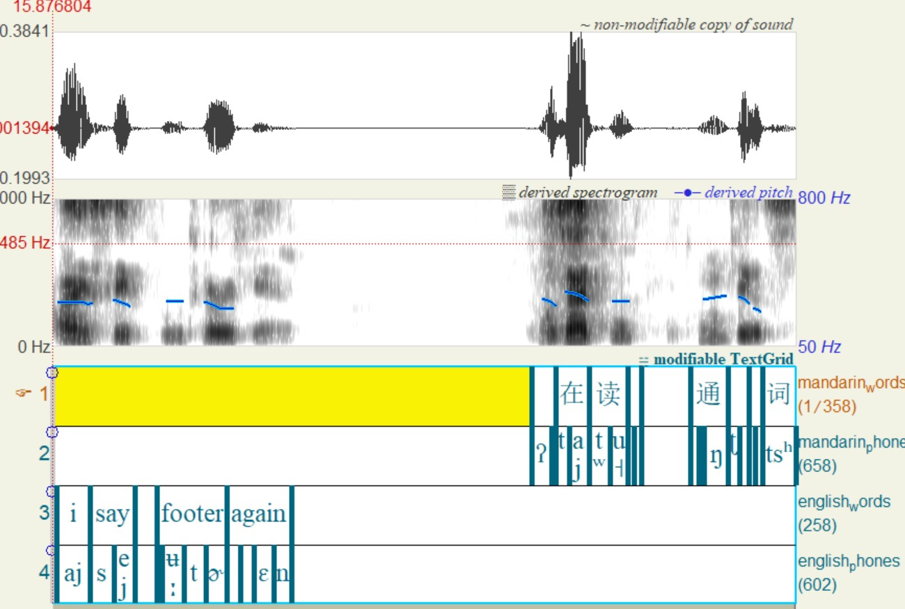

# Phonetic-Drift-Project-Aligners
This is a set of tools to prepare English-Mandarin audio transcripts for 2 passes of allignment through Montreal Forced Aligners. The output TextGrid contains English words, English phones, Mandarin words, and Mandarin phones all on different tiers.

<div align="center">
  
### Preview output textgrid viewed in Praat
  
  
</div>

## Running on local machine

1. Clone this repository.

2. Navigate to project directory

3. Set up virtual environment

```
python -m venv .venv

# Windows command prompt
.venv\Scripts\activate.bat

# Windows PowerShell
.venv\Scripts\Activate.ps1

# macOS and Linux
source .venv/bin/activate
```

4. Run the command `pip install -r requirements.txt` in the terminal

## How to use

Make sure to have audio transcripts in wav formated as 16 KHz, 16-bit precision, and mono channel. Transcripts are formated in Excel that conations the ID, data, first half of the transcript, and the second half all in different columns.

### text_cleaner.py
This file is run to generate .txt file transcripts for the entire dataset. It outputs a name in this format `ID_m.d.txt`. When this file is run it will ask for your Excel file and a directory to output the transcripts to. After that the process is almost automatic, but if dates in the Excel file are not able to be parsed the user will be asked to enter in the date manually. This script basically puts all the target words into their carrier phrases and writes that to a text file.

### textgrid_prep.py
This is the last script to run before running MFA....tbc
